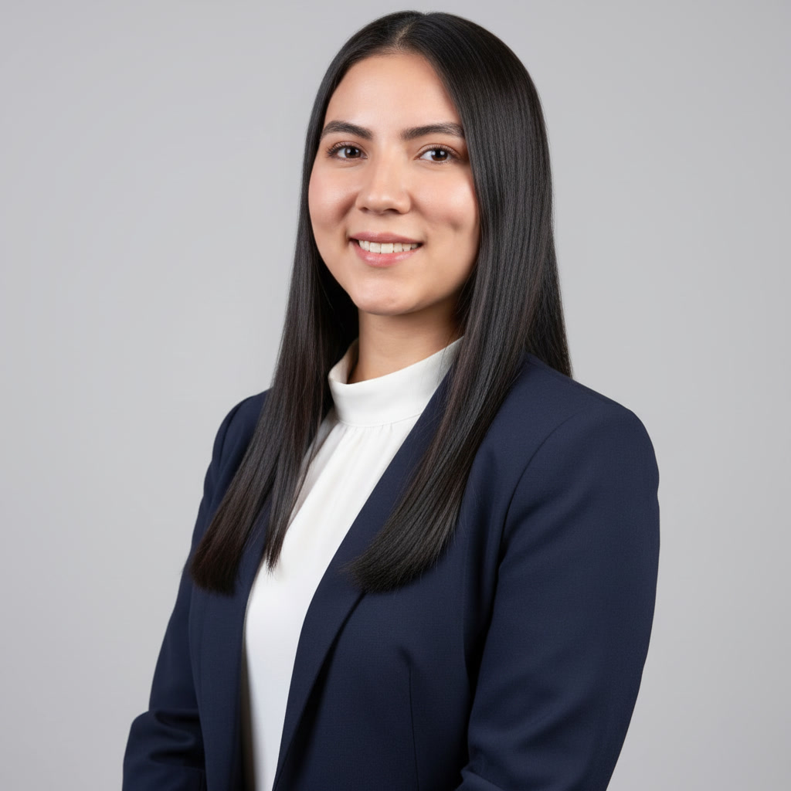

# Laura Marcela Galvis Castro - Abogada Especialista



Página web profesional de Laura Marcela Galvis Castro, abogada especialista en Derecho Comercial y socia de GRUPO LADA.

## 🌐 Sitio en línea

**URL:** [https://abogadalauragalvis.com](https://abogadalauragalvis.com) *(configurar con tu dominio)*

---

## ✨ Características

- **Diseño elegante y minimalista** - Paleta de colores negro y dorado champagne
- **Totalmente responsivo** - Adaptado a móvil, tablet y desktop
- **Animaciones suaves** - Efectos de scroll profesionales
- **SEO optimizado** - Meta tags y estructura semántica
- **Alto rendimiento** - Carga rápida y optimizada

---

## 🎨 Identidad Visual

| Elemento | Valor |
|----------|-------|
| **Logo** | L\|G |
| **Negro principal** | `#1A1A1A` |
| **Dorado/Champagne** | `#C9A84C` |
| **Tipografía** | Libre Franklin (Google Fonts) |

---

## 📄 Secciones

1. **Hero** - Presentación con imagen en blanco y negro
2. **Estadísticas** - Contadores animados (años, casos, empresas)
3. **Sobre mí** - Biografía profesional con imagen a color
4. **GRUPO LADA** - Abre bocas de la sociedad tecnológico-jurídica
5. **Servicios** - 6 áreas de práctica jurídica
6. **¿Por qué elegirme?** - Diferenciadores profesionales
7. **Clientes** - Tipos de clientes y testimonios
8. **Contacto** - Formulario + información de contacto

---

## 🛠️ Tecnologías

- [React](https://react.dev/) - Framework UI
- [TypeScript](https://www.typescriptlang.org/) - Tipado estático
- [Tailwind CSS](https://tailwindcss.com/) - Estilos
- [Vite](https://vitejs.dev/) - Build tool
- [shadcn/ui](https://ui.shadcn.com/) - Componentes UI
- [Lucide React](https://lucide.dev/) - Iconos

---

## 🚀 Despliegue

### Opción 1: Netlify (Recomendado)

1. Crea cuenta en [netlify.com](https://netlify.com)
2. Arrastra la carpeta `dist` al dashboard
3. Configura tu dominio personalizado

### Opción 2: Vercel

```bash
npm i -g vercel
vercel --prod
```

### Opción 3: GitHub Pages

```bash
npm run build
# Subir contenido de /dist a rama gh-pages
```

---

## 📞 Contacto

- **WhatsApp:** 320 569 8922
- **Email:** l.galviscabogada@hotmail.com
- **Ubicación:** Manizales, Caldas / Armenia, Quindío - Colombia

---

## ©️ Derechos

© 2025 Laura Marcela Galvis Castro. Todos los derechos reservados.

GRUPO LADA - Firma Jurídica y Tecnológica
